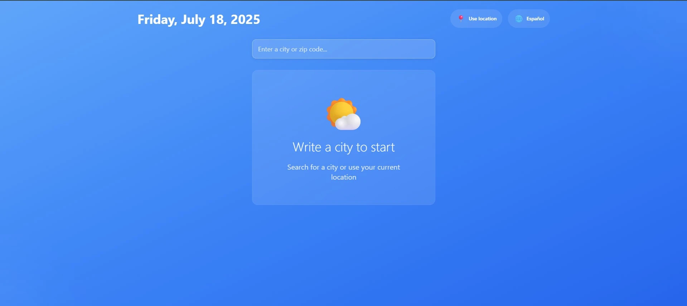
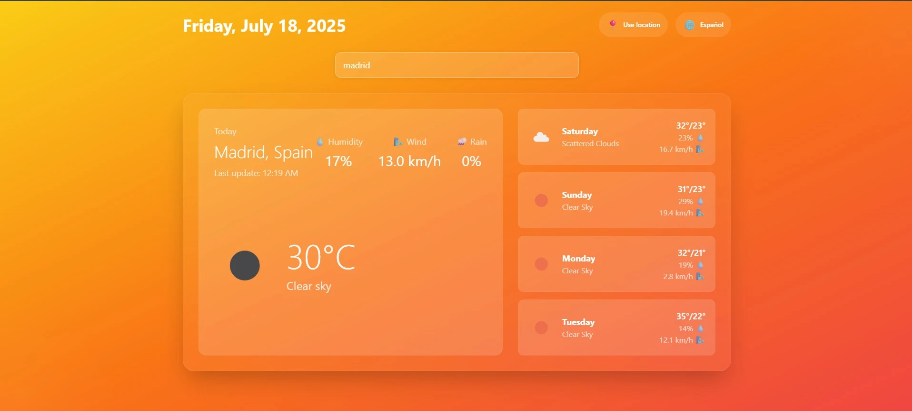
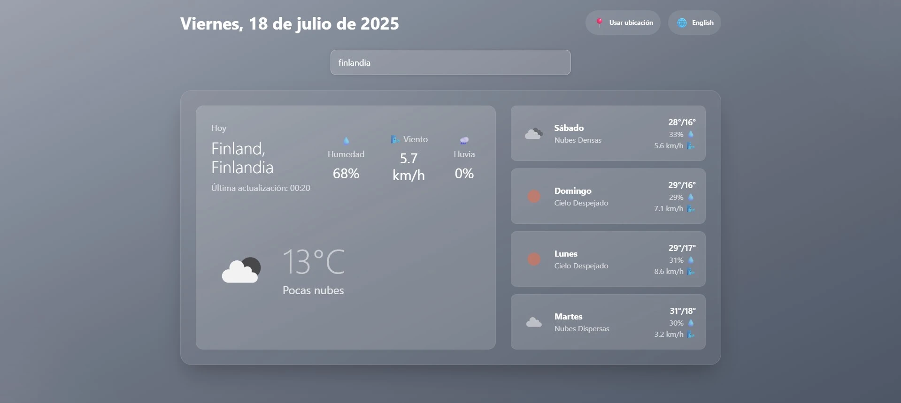

# 🌤️ Best Weather Web - App del Clima con React

¡Bienvenido/a! Este es un proyecto sencillo para consultar el clima actual y el pronóstico de los próximos días usando React, Vite y la API de OpenWeather. Ideal para practicar y aprender como desarrollador/a junior.

---

## 🖼️ Vista previa

A continuación puedes ver cómo se ve la aplicación en diferentes estados:

### Antes de la llamada a la API


### Después de la llamada (día soleado)


### Día nublado (en español)


---

## 🚀 ¿Qué hace esta app?
- Muestra el clima actual de una ciudad (temperatura, humedad, viento, etc.)
- Permite buscar ciudades con autocompletado
- Puedes ver el pronóstico de los próximos 4/5 días
- Opción para ver el clima de tu ubicación actual (usando GPS)
- Cambia entre español e inglés fácilmente
- Diseño adaptable a móvil, tablet y PC

---

## 🛠️ Tecnologías usadas
- **React**: Biblioteca para construir interfaces de usuario
- **Vite**: Herramienta para desarrollo rápido de proyectos en React
- **Tailwind CSS**: Framework para estilos rápidos y modernos
- **OpenWeather API**: Provee los datos del clima

---

## 📦 Instalación paso a paso

### 1. Clona el repositorio y entra a la carpeta del frontend
```bash
git clone https://github.com/Alvaroasdev/weatherv3.git
cd weatherv3/frontend
```

### 2. Instala las dependencias
```bash
npm install
```

### 3. Consigue tu API Key de OpenWeather
1. Ve a [OpenWeather](https://openweathermap.org/)
2. Regístrate gratis y copia tu API key

### 4. Crea el archivo de variables de entorno
```bash
echo "VITE_OPENWEATHER_API_KEY=tu_api_key_aqui" > .env.local
```
Reemplaza `tu_api_key_aqui` por la clave que copiaste.

### 5. Ejecuta la app en modo desarrollo
```bash
npm run dev
```
Abre tu navegador en [http://localhost:5173](http://localhost:5173)

---

## 📝 Consejos para juniors
- Si algo no funciona, revisa la consola del navegador y la terminal para ver errores.
- Asegúrate de tener la API key correcta y de esperar unos minutos si la acabas de crear.
- Si tienes problemas con CORS, intenta usar el backend incluido (ver abajo).
- Lee los comentarios en el código, te ayudarán a entender cómo funciona cada parte.

---

## ⚙️ Variables de entorno
- `VITE_OPENWEATHER_API_KEY`: Tu clave de OpenWeather (obligatoria)
- `VITE_BACKEND_URL`: (Opcional) URL del backend si decides usarlo

---

## 🖥️ ¿Quieres usar el backend opcional?
1. Ve a la carpeta `backend`
2. Instala dependencias: `npm install`
3. Crea `.env.local` con tu API key: `echo "API_KEY=tu_api_key_aqui" > .env.local`
4. Ejecuta: `npm run dev`

---

## 🐞 Problemas comunes y soluciones
- **No funciona el autocompletado**: Verifica tu API key
- **Error de CORS**: Usa el backend local
- **API key inválida**: Espera unos minutos tras crearla

---

## 📚 Recursos útiles
- [Documentación de React](https://es.react.dev/)
- [Guía de Vite](https://vitejs.dev/guide/)
- [Tailwind CSS](https://tailwindcss.com/docs/installation)
- [API de OpenWeather](https://openweathermap.org/api)

---

## 📄 Licencia
MIT License

---

⭐ **Si te sirvió este proyecto, ¡dale una estrella y sigue aprendiendo!**

---

## 💡 Qué aprendí haciendo este proyecto
- Cómo consumir APIs externas en React
- Uso de hooks personalizados
- Manejo de variables de entorno
- Buenas prácticas con Tailwind y Vite

---

## 🤝 Contribuciones
¡Las contribuciones son bienvenidas! Si encuentras un error o tienes una mejora, abre un issue o haz un pull request.

---
